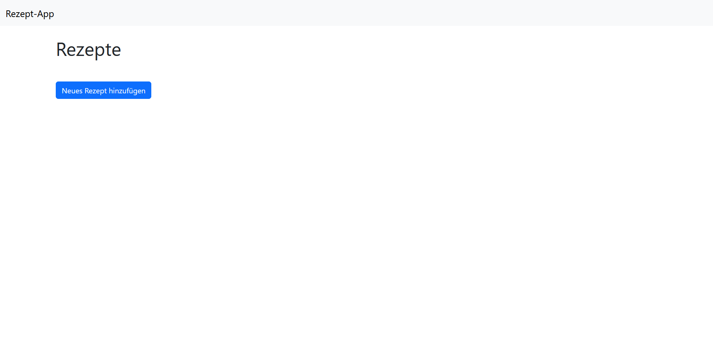
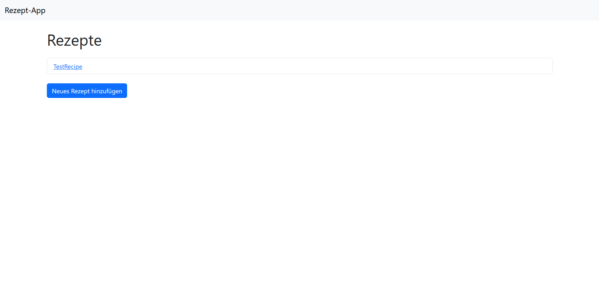
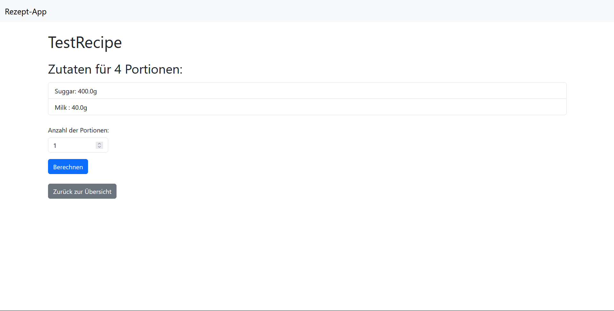

# RecipeApp

## Install
Clone the repository and install flask and flask_sqlalchemy  
`pip install flask`  
`pip install flask_sqlalchemy`  

## Run
Run app.py   and open the URL shown in the terminal  
The web ab are self-explaning    

Main page

Add recipe

List of recipes

Show recipe

Calculate Recipe ingredients
